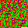
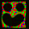

# Colorspace

##### by Sebastian Krzyszkowiak and Agata Kurczewska

* * *

Colorspace is an ezoteric programming langugage which uses images as source code. Syntax is translatable and compatible with [Whitespace](http://compsoc.dur.ac.uk/whitespace).

Download [Colorspace interpreter](colorspace) in Python (using [wspace](http://compsoc.dur.ac.uk/whitespace/downloads/wspace))

_Usage: ./colorspace image.png_

_Remember to install wspace interpreter (under debian "apt-get install whitespace")._

Download [Whitespace to Colorspace translator](colorspace-decompiler) in Python

Download [Whitespace to Colorspace image converter](colorspace-convert), also in Python

* * *

### Examples:

*   Hello world: 
*   Hello world once again: 
*   Factoid (generated with colorspace-decompiler): 
*   Factoid (generated with provided image and colorspace-convert): 

* * *

All codes available here are under GNU GPLv2+ licence.
